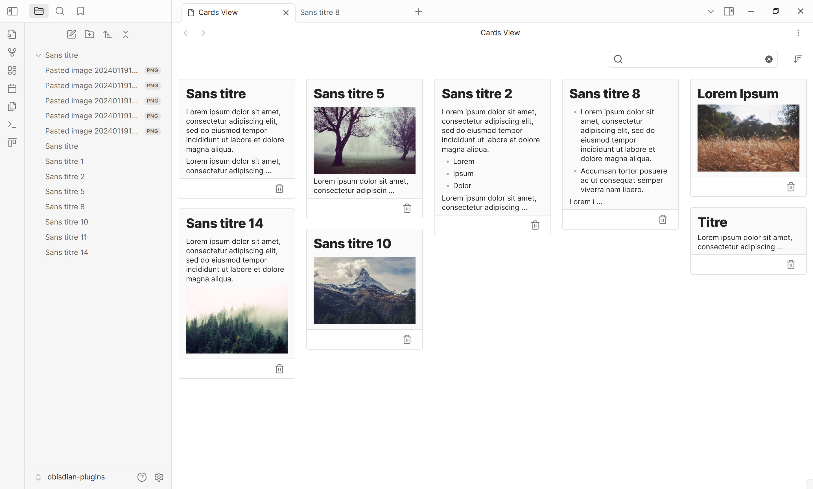

# Cards View

This is a plugin for Obsidian.md that displays a card view of your notes.

## Features

- Display notes in a card view
- Sorts by last modified or created date
- Pin notes to top
- Supports same [search syntax](https://help.obsidian.md/Plugins/Search#Search+terms) as Obsidian official 
  search plugin (except `block:`, `section:` and `task*:` operators)
- Quick access to filtering by tags
- Settings to exclude some notes from the view

## Installation

1. Navigate to Obsidian's settings
2. Click on "Third-party plugin"
3. Turn off the Safe mode
4. Click on "Browse" and search for "Obsidian Cards View Plugin"
5. Click install
6. Toggle the plugin on in the "Installed plugins" tab

## Contributing

For major changes, please open an issue first to discuss what you would like to change.
Pull requests are welcome. Please read [CONTRIBUTING.md](https://github.com/jillro/obsidian-cards-view-plugin/blob/main/CONTRIBUTING.md) for details.

## License

[MIT](https://choosealicense.com/licenses/mit/)

## Credits

This project uses the following dependencies:

- [Masonry](https://masonry.desandro.com/). Licensed under the [MIT License](https://desandro.mit-license.org/).
